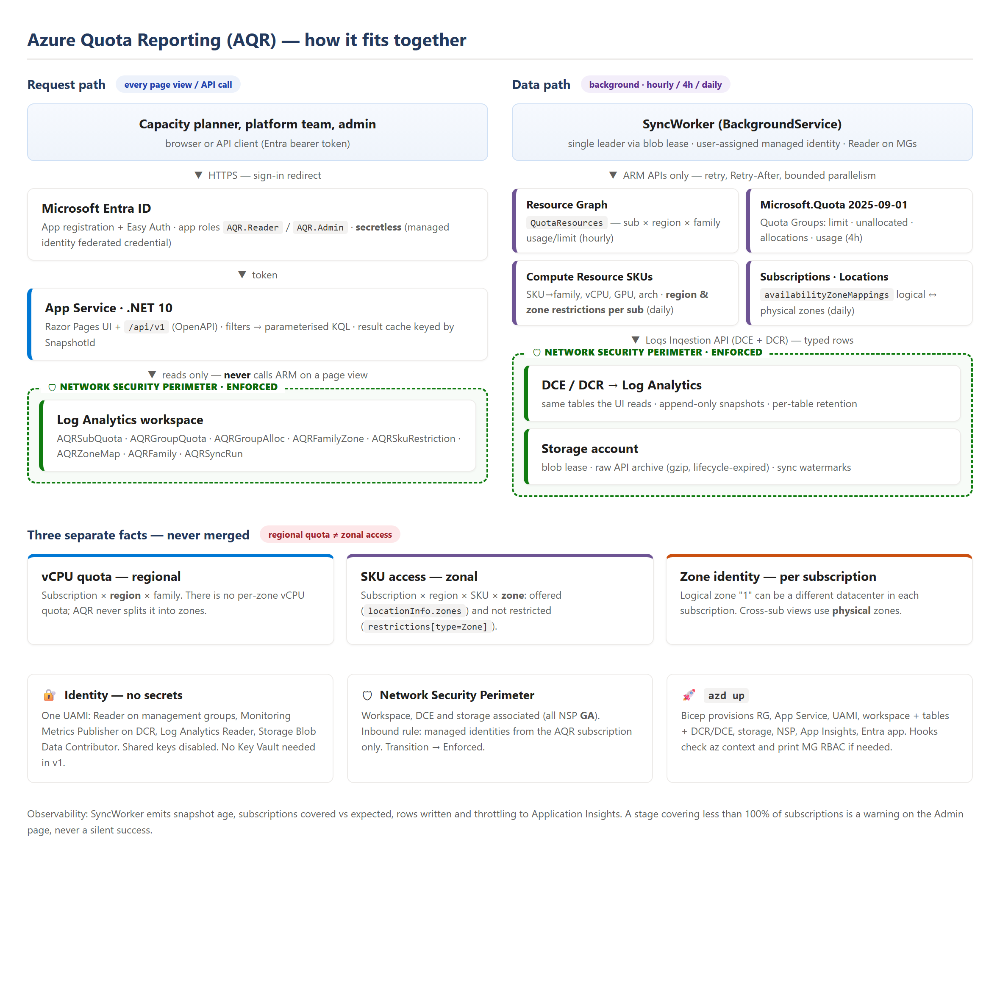
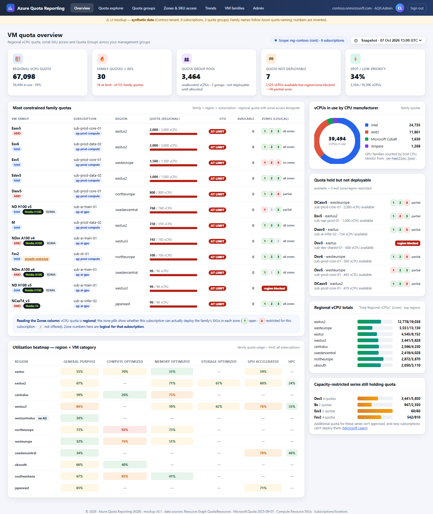
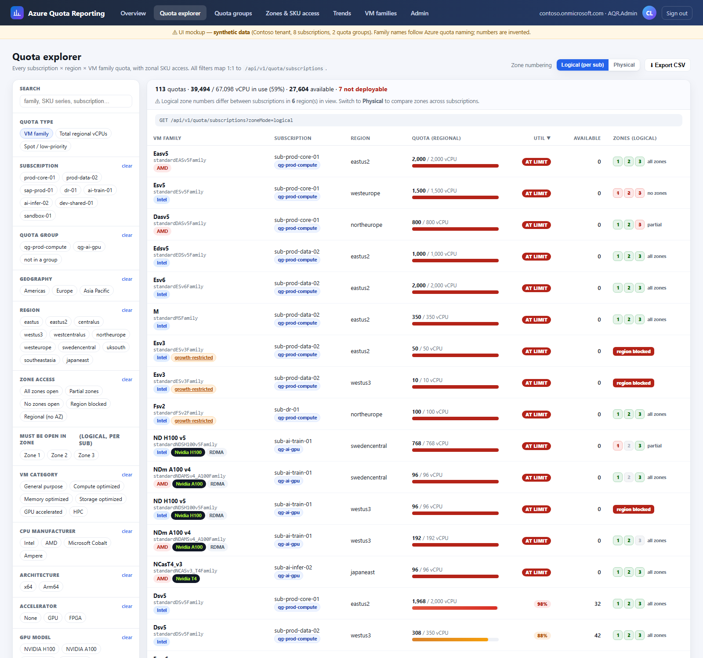
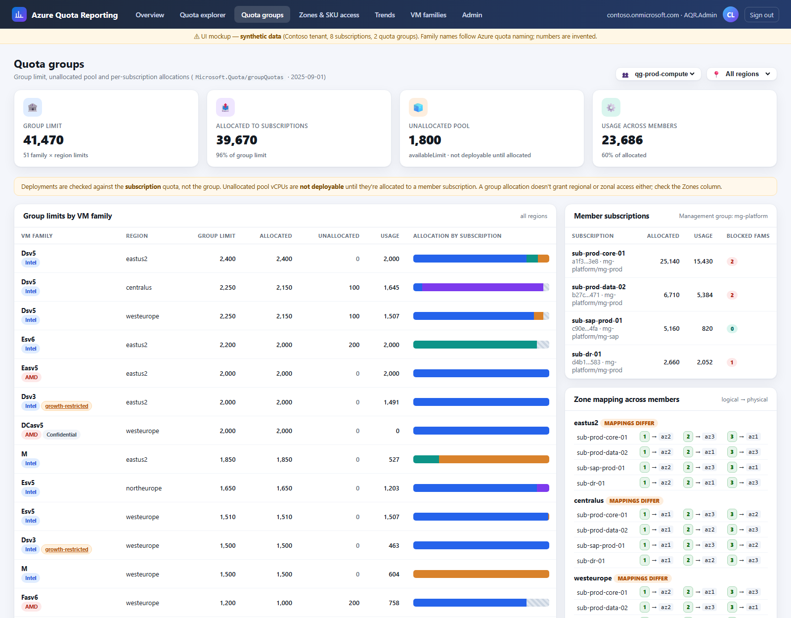
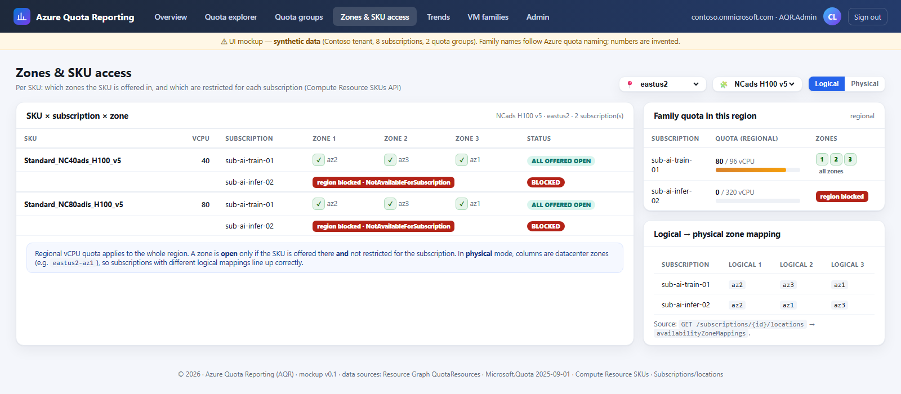

# Azure Quota Reporting (AQR)

Org-wide reporting on **Azure VM quota**: subscription quota, **Azure Quota Groups**, and
**zonal SKU access**. Deployed into your own subscription with `azd up`, behind Entra ID sign-in,
with its data store inside a Network Security Perimeter.

> **Status:** design phase. Nothing is deployable yet. Start with the docs below.

| Doc | What's in it |
|---|---|
| [docs/ARCHITECTURE.md](docs/ARCHITECTURE.md) | Architecture design: data sources, store decision, regional-vs-zonal model, data model, sync, API, `azd` layout, roadmap, open questions |
| [docs/mockups/aqr-mockup.html](docs/mockups/aqr-mockup.html) | Clickable UI mockup on synthetic data. Open it in a browser; filters, zone toggle and CSV export work |
| [docs/images/src/architecture.html](docs/images/src/architecture.html) | Source for `docs/images/architecture.png` |

## Mockup screenshots

| Overview | Quota explorer |
|---|---|
|  |  |

| Quota groups | Zones & SKU access |
|---|---|
|  |  |

*(All numbers are synthetic.)*
